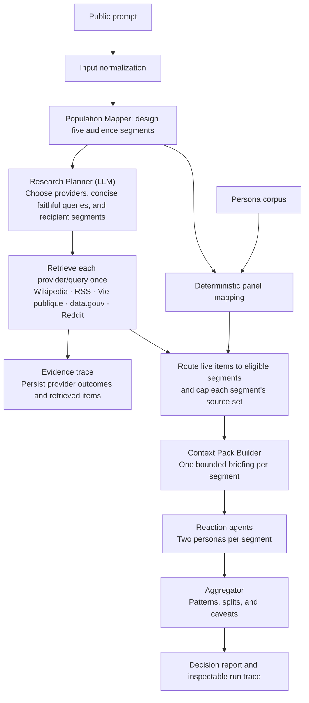

# Tweenverse

Tweenverse is a research-oriented prototype for synthetic public-opinion simulation. Its goal is not to predict the future by extrapolating from raw text alone, but to model how different kinds of people might interpret the same prompt once it is filtered through heterogeneous priors, material constraints, and live information environments.

In practical terms, Tweenverse takes a public prompt such as a policy question, article, proposal, or speech and produces:
- a segmented synthetic audience
- an LLM-planned evidence search across public information channels
- segment-specific context packs
- persona-level reactions
- an aggregate divergence report

The system is best understood as a multi-agent inference pipeline for grounded opinion simulation.

## Research framing

Tweenverse sits at the intersection of:
- synthetic populations
- retrieval-augmented generation
- multi-agent decomposition
- structured opinion elicitation

The core scientific hypothesis is:

> Simulated public reactions become more believable when generation is constrained by three distinct structures:
> a population prior, an external evidence layer, and an explicit decomposition of reasoning into specialized agent roles.

This is different from asking a single model, in one step, "What would people think?" Tweenverse instead treats opinion formation as a staged process:
- first decide which social segments are relevant
- then gather public evidence
- then translate that evidence into segment-level informational context
- then simulate reactions at the persona level
- then aggregate disagreements and common patterns

## What The System Is Modeling

Tweenverse is not trying to estimate vote share, recover ground-truth survey results, or replace representative sampling. It is trying to model a different object:

the structured space of plausible reactions that may emerge when a heterogeneous audience encounters a prompt under unequal exposure, unequal incentives, and unequal prior beliefs.

That distinction matters. The system is designed to surface:
- which groups are likely to care
- what each group would notice or ignore
- why identical evidence can produce different reactions
- where disagreement is driven by costs, trust, convenience, or perceived fairness

## Architecture Overview

The pipeline combines deterministic orchestration with role-specialized model agents. The orchestration layer controls sequence, validation, persistence, and failure handling. The model agents perform bounded inference tasks with structured outputs.



The population mapper first designs the segment descriptions. From there, persona mapping and research planning run in parallel: one path selects representative people while the other plans and collects the information environment those segments may encounter. The two paths meet only when live evidence is routed into segment-specific context packs.

## Why It Is Multi-Agentic

Tweenverse is multi-agentic in the scientific sense, not because it launches autonomous long-lived software workers, but because it decomposes a cognitively broad task into narrower agent roles with different responsibilities and output schemas.

The current role structure is:
- `PopulationMapperAgent`
  Determines which audience segments are relevant and how personas should be grouped.
- `ResearchPlannerAgent`
  Receives the original question and the five segment descriptions, then chooses a minimal set of provider/query tasks and the segments each task can inform.
- `ContextPackBuilderAgent`
  Converts retrieved evidence plus segment characteristics into a compact informational framing for each segment.
- `ReactionAgent`
  Simulates the responses of the evaluated personas inside a specific segment framing.
- `AggregatorAgent`
  Compresses multiple persona reactions into a higher-level account of consensus, uncertainty, and divergence.

This decomposition has three advantages:
- it reduces entanglement between segmentation, evidence interpretation, and final narration
- it makes intermediate artifacts inspectable rather than hiding the entire chain inside one opaque generation
- it allows each stage to be schema-constrained and therefore easier to evaluate, compare, and improve

## Information Flow

Tweenverse operates over three interacting layers.

### 1. Population prior

The population layer provides the system with a structured synthetic audience rather than a blank "average person." In the current prototype, the persona corpus is derived from a France-focused synthetic dataset and then enriched with metadata that supports segmentation, such as life stage, employment class, mobility profile, economic posture, and issue-salience tags.

Scientifically, this layer encodes heterogeneity. It is the mechanism that lets the system ask not "what does the public think?" but "which publics are relevant here, and why?"

#### Persona mapping

Tweenverse does not simulate directly from raw persona prose. It first converts a sampled Hugging Face persona pool into a prompt-specific synthetic audience panel through a deterministic, metadata-first mapping stage:

```text
Hugging Face persona rows
          |
          v
+---------------------------+
| normalize base personas   |
| age, city, job, household |
+---------------------------+
          |
          v
+---------------------------+
| derive assignment metadata|
| life stage, class,        |
| urbanicity, vulnerability,|
| trust, salience           |
+---------------------------+
          |
          v
+---------------------------+
| LLM defines 5 segments    |
| using only that taxonomy  |
+---------------------------+
          |
          v
+---------------------------+
| deterministic scoring     |
| eligibility -> affinity   |
+---------------------------+
          |
          v
+---------------------------+
| diversified 20-person     |
| panel selection           |
+---------------------------+
          |
          v
context packs -> reactions -> divergence report
```

Methodologically, the step has four parts:
- normalize each dataset row into a common persona schema
- derive reusable assignment metadata from structured fields plus deterministic cues in the French profile narrative
- induce five prompt-relevant audience segments, constrained to the observed metadata taxonomy
- score personas against segments using structured tag matches only, then build a compact panel that preserves segment coverage while reducing near-duplicate profiles

This mapping stage is the system's population prior. It fixes who is analytically relevant before retrieval and reaction simulation, so downstream outputs reflect situated social positions rather than an undifferentiated "average citizen."

### 2. Evidence layer

The evidence layer retrieves public signals from multiple sources with different epistemic roles:
- encyclopedic background for stable context
- recent news framing for salience and media presentation
- official policy publications for institutional framing
- official open-data publications for factual public datasets
- public discourse signals for informal debate and attention

This layer approximates the informational environment surrounding the prompt. It does not claim that every persona sees the same evidence, only that the system should not simulate reactions in an evidentiary vacuum.

### LLM-planned retrieval and segment routing

Retrieval is no longer a fixed query fan-out. The `ResearchPlannerAgent` sees the original user question alongside the full set of segment descriptions, concerns, and information needs. It returns a small structured plan: provider, faithful query, intended segment IDs, a terse rationale, and the concerns that triggered the request.

The orchestration layer validates that plan before making network calls. It prevents duplicate provider/query pairs, limits the plan to six tasks (including at most two RSS searches), and reuses one retrieval for every segment that can benefit from it. A provider is therefore queried once for a shared information need, never once per segment.

Retrieved live items are then routed only to the segments named by the plan and ranked against that segment's concerns and representative personas. Each segment receives at most three items. Context packs contain titles and bounded provider snippets rather than full article bodies; the exact source IDs supplied to each pack are persisted, so the evidence trace can show which segments received every item.

### 3. Agentic reasoning layer

The reasoning layer transforms population priors and evidence into synthetic responses. It does so gradually:
- segment first
- contextualize second
- react third
- summarize last

That order is deliberate. It mirrors a theoretical view in which opinion is not a direct function of prompt text alone, but the result of prompt text interacting with group position, selective exposure, and practical consequence.

## End-To-End Lifecycle

For a single run, the system proceeds as follows:

1. A user submits a prompt.
2. The population-mapping agent designs five prompt-relevant audience segments.
3. In parallel, deterministic mapping selects a representative panel while the research planner creates a segment-aware retrieval plan.
4. The retrieval subsystem executes each planned provider/query pair once and records the outcome.
5. Live items are routed to the relevant segments, then the context-pack agent writes one bounded briefing per segment.
6. Reaction agents simulate a small number of persona-level responses inside each segment.
7. The aggregator agent turns those responses into a divergence report.
8. The interface exposes both the final narrative and the intermediate artifacts used to construct it.

This makes the system closer to a computational lab for audience interpretation than to a one-shot chatbot.

## What The Output Means

The final report should be interpreted as a structured synthetic analysis, not as a measurement.

It is useful for:
- comparing likely reactions across audience segments
- stress-testing framing choices
- identifying groups with materially different stakes
- surfacing likely misunderstandings or trust failures
- exploring how evidence exposure shapes interpretation

It is not valid as:
- a representative poll
- a forecast of actual vote share
- a substitute for survey fieldwork
- a causal estimate of real-world persuasion effects

## Why The Intermediate Artifacts Matter

One of the main design choices in Tweenverse is to preserve intermediate objects rather than collapse everything into a final answer.

Those objects include:
- segment definitions
- persona assignments
- retrieval results
- context packs
- persona-level reactions
- aggregate divergences

This matters for scientific and product reasons:
- it improves inspectability
- it makes failure modes easier to diagnose
- it allows stage-level evaluation
- it supports ablation-style reasoning about which component changed the final outcome

In other words, Tweenverse is designed to expose a trace of synthetic reasoning, not just its conclusion.

## Current Product Surface

The current app is intentionally small:
- `/`
  Editorial homepage describing the thesis.
- `/personas`
  A browsable view of the persona layer.
- `/lab`
  The experiment surface for running the end-to-end pipeline.

Historical UI paths are documented in [docs/legacy-pages.md](/Users/leodreyfusschmidt/Desktop/Repos/tweenverse/docs/legacy-pages.md).

## Operational Notes

The live lab pipeline depends on an OpenAI API key and uses structured outputs to keep every agent stage machine-parseable.

The retrieval layer is also designed to degrade gracefully:
- successful providers contribute live evidence
- provider failures and timeouts are recorded as provider outcomes rather than being presented as sources

This makes uncertainty and source failure visible without inventing evidence.

## Pipeline Performance Notes

The current orchestration keeps the slowest work off the critical path where possible:
- after segment design, research planning and retrieval run in parallel with deterministic panel mapping
- context-pack generation runs in parallel across the five derived segments
- persona reactions are batched per segment so the system makes five reaction calls rather than ten individual persona calls
- run state is kept in memory during execution and persisted at stage checkpoints rather than rereading the full run record between stages

The research planner deliberately plans a shared set of searches across segments, rather than multiplying calls by five. Full-article extraction and model-generated summarisation are deliberately deferred: current context packs use bounded provider extracts to control token load and preserve an inspectable retrieval trace.

## How To Run

Install dependencies and start the app:

```bash
npm install
npm run dev
```

Run tests:

```bash
npm test
```

Create a production build:

```bash
npm run build
```

Refresh the local source manifest:

```bash
npm run sync:sources
```

To run the live multi-agent lab rather than only the static surfaces, set:

```bash
OPENAI_API_KEY=...
```

Optionally configure:

```bash
OPENAI_MODEL=...
HF_PERSONA_CACHE_TTL_HOURS=...
```

## Summary

Tweenverse is a synthetic audience lab built around a simple claim: believable opinion simulation requires more than text generation. It requires explicit population structure, explicit evidence, and explicit decomposition of reasoning into specialized agents.

That combination is the system's main contribution and the right lens for understanding the project.
