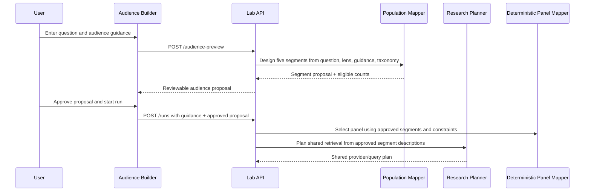

# Guided Audience Builder — Implementation Plan

## Objective

Keep Tweenverse's automatic audience construction, but let a user guide it before a run. The user should be able to say **who this question needs to be tested with** without having to hand-author personas, write segment logic, or understand the internal metadata taxonomy.

The product must remain a synthetic audience simulation. It must not imply that the user has built a representative sample or targeted real individuals.

## Product decision

This is a **guided builder**, not a manual segment editor.

The system still creates exactly five segments and selects the panel deterministically. The user supplies a compact audience brief and a small number of explicit inclusion/exclusion constraints; Tweenverse proposes the segments, shows them for review, and uses the approved proposal for the run.

This gives the user meaningful control while retaining three safeguards:

- segment tags remain grounded in the persona dataset's available metadata;
- the panel remains diverse within the requested audience, rather than becoming five copies of one stereotype;
- the final run records exactly what the user asked for and what the system constructed.

## Scope for v1

### Supported controls

The form has two modes.

1. **Automatic** — today's behavior. The user selects an audience lens and Tweenverse defines the segments.
2. **Guided** — the user can add a short audience brief and a small number of required or excluded attributes.

In Guided mode, expose only these controls:

- **Audience lens**: existing preset (`France-wide panel`, `Le Figaro readership lens`, or `French TV viewer panel`).
- **Who should this represent?**: a short plain-language brief, such as “working parents in secondary cities who are concerned about transport costs.”
- **Must include**: up to three dataset-backed attributes.
- **Avoid over-representing**: up to three dataset-backed attributes.
- **What should the audience be especially attentive to?**: up to three short concerns. These inform segment design and source planning; they are not claims about individual media consumption.

The selectable attributes are generated from the existing persona metadata taxonomy. v1 supports life stage, household type, employment class, income posture, housing status, mobility profile, urbanicity, region family, public-service dependency, and the existing tag families. It does not introduce a second audience taxonomy.

### Explicit non-goals for v1

- no freehand creation, deletion, or reweighting of individual personas;
- no user-defined demographic quotas or promises of representativeness;
- no direct claim that a segment read a particular publication;
- no new mode for the TV audience-prediction run;
- no saved/reusable audience library yet;
- no protected-trait targeting or personal-data upload.

## User experience

### 1. Configure before the run

For the manual-question lab, place an **Audience** section directly below the prompt and above the Run button.

```text
Question
[ user question ]

Audience
Lens: [ France-wide panel v ]
Mode:  (•) Let Tweenverse choose   ( ) Guide the audience

When guided:
Who should this represent?
[ Working parents in secondary cities...                         ]

Must include                 Avoid over-representing
[ Mobility: car-dependent ]  [ Life stage: retired ]

Priority concerns
[ household costs ] [ local services ]

[ Preview audience ]
```

Use searchable, readable labels in the controls; never expose internal names such as `income_posture` or `issue_salience_tags`.

### 2. Preview and approve

`Preview audience` produces an **Audience proposal**, without starting retrieval or persona reactions. It shows:

- the five proposed segment labels and one-line descriptions;
- the user guide that shaped the proposal;
- the count of eligible dataset personas per segment and an overall availability warning if a constraint is too narrow;
- a compact “why this is in the panel” explanation, based only on the selected attributes and the question.

The actions are:

- **Use this audience** — freezes the proposal into the next run;
- **Refine guidance** — returns to the form without losing selections;
- **Generate another proposal** — requests a new segment design from the same guide.

Do not show raw inclusion tags as the primary interface. An advanced disclosure may show them for audit.

### 3. Result trace

The completed run gets an **Audience definition** disclosure above the segment cards. It contains the lens, user brief, chosen attributes, priority concerns, and the approved segment proposal. This keeps the result interpretable without adding a new dense card to the report.

The Evidence Trace continues to show how sources reached each segment. The Research Planner receives the approved segment descriptions and priority concerns, so guidance can affect which sources are selected without pretending to know each person's exact media diet.

## Minimal data model

Use one compact object. Reuse `MetadataTagFilter` rather than creating a parallel filter format.

```ts
type AudienceGuidance = {
  mode: "automatic" | "guided";
  brief?: string;
  include?: MetadataTagFilter[];
  avoid?: MetadataTagFilter[];
  priorityConcerns?: string[];
};
```

Add it to `PersistedLabRun` as `audienceGuidance`, defaulting to `{ mode: "automatic" }`. Existing runs must parse unchanged through that default.

The approved proposal uses the existing `PopulationMap` / `PopulationSegmentSpec` structure. Add one optional `approvedSegmentDesign` field to the run record rather than duplicating segment types. It is written only after the user clicks **Use this audience**.

## Server workflow



### Preview endpoint

Add `POST /api/lab/audience-preview`.

Request:

```ts
{
  input: LabInput;
  audiencePreset: AudiencePreset;
  guidance: AudienceGuidance;
}
```

Response:

```ts
{
  proposal: PopulationMap;
  eligibility: Array<{ segmentId: string; eligiblePersonaCount: number }>;
  warnings: string[];
}
```

The endpoint loads the same persona cache and metadata taxonomy as the run pipeline. It validates every selected filter against that taxonomy, invokes `designPopulationSegments`, and calculates eligibility using the same scoring/filtering helpers used by `mapPopulationToPanel`.

### Run creation and execution

Extend `POST /api/lab/runs` to accept `audiencePreset`, `audienceGuidance`, and an optional `approvedSegmentDesign`.

On run creation:

1. Parse and bound the guidance: brief length, three include filters, three avoid filters, and three priority concerns.
2. Validate filter families and values against the current persona metadata taxonomy.
3. Validate the approved design against `populationMapSchema`; reject it if its tags no longer match the taxonomy.
4. Persist the guidance and approved design with the run.

During execution:

1. Use `approvedSegmentDesign` if present; otherwise run the existing segment-design call.
2. Pass `AudienceGuidance` into population design so the mapper can describe the requested audience faithfully.
3. Apply `include` as hard eligibility filters. Treat `avoid` as a deterministic score penalty, not an absolute ban, so the panel can retain useful internal contrast.
4. Preserve the current deterministic selection and diversity logic.
5. Pass the approved segments, including their concerns and information needs, to the Research Planner exactly as today.

Do not pass the raw user brief directly into reaction prompts. The approved segments and their bounded context packs remain the interpretation boundary.

## Code changes

### Schemas and persistence

- `src/lib/labSchemas.ts`
  - Add `audienceGuidanceSchema` and `approvedSegmentDesign` to the persisted run schema.
  - Bound all user-authored text and array sizes.
- `src/server/lab/persistence.ts`
  - Default old records to automatic guidance.
- `src/server/lab/pipeline.ts`
  - Reuse an approved segment design and include guidance in the population stage logs.

### Population mapping

- `src/server/lab/populationMapping.ts`
  - Accept optional guidance in `designPopulationSegments` and `mapPopulationToPanel`.
  - Include the guide in the mapper's structured user payload.
  - Extract a shared eligibility helper so preview and run execution use identical logic.
  - Log the number of included/avoided filters, eligible candidates, and whether the design was user-approved. Never log the raw brief if logs may be broadly accessible.

### API and UI

- `src/app/api/lab/audience-preview/route.ts`
  - Implement the preview contract and clear validation errors.
- `src/app/api/lab/runs/route.ts`
  - Accept and persist audience fields for manual runs. Keep the existing fixed presets for Le Figaro and TV modes.
- `src/components/lab/AudienceBuilder.tsx`
  - New focused component for the form, preview state, and approval action.
- `src/components/lab/LabPageClient.tsx`
  - Compose `AudienceBuilder`, pass its approved design on submission, and show the result-trace disclosure.
- `src/styles.css`
  - Add a compact two-column constraint layout that collapses cleanly on mobile. The preview should read as an editorial audience brief, not a settings panel.

## Validation and telemetry

### Tests

- schema defaults keep historical runs readable;
- preview rejects unknown metadata values and too many filters;
- the same guidance yields the same eligibility result in preview and execution;
- approved designs bypass a second population-design call;
- include filters are respected by every selected persona;
- avoid filters reduce selection priority without eliminating all diversity;
- manual runs serialize guidance and render it in the result trace;
- Le Figaro and TV flows retain their existing preset behavior;
- planner input includes the approved segment concerns and information needs, not raw unbounded form text.

### Product telemetry

Record structured events for: builder opened, automatic/guided chosen, preview requested, preview warning shown, proposal regenerated, proposal approved, run started with guidance, and guidance-related run failure. Record counts and selected metadata families, not the free-text brief.

The first success metric is the share of manual runs that reach an approved audience proposal. The quality metric is a short post-run prompt: **“Did these segments represent the audience you intended to test?”**

## Delivery sequence

1. Add schemas, persistence defaults, eligibility helper, and tests.
2. Add the preview endpoint and a server-only integration test using the current persona cache fixture.
3. Ship the Guided/Automatic selector and preview/approval UX for manual runs.
4. Reuse approved designs in the pipeline and show the Audience definition trace.
5. Instrument the flow, test with five to ten real research questions, and tune the controls before enabling guided refinement for Le Figaro mode.

## Acceptance criteria

- A user can run automatically without seeing additional complexity.
- A guided user can express an intended audience in under two minutes and approve a visible five-segment proposal.
- The run uses the approved proposal rather than silently redesigning the audience.
- Every selected persona satisfies required filters.
- Every source, context pack, and reaction remains traceable to the final approved segments.
- Existing manual, Le Figaro, and TV runs keep working without a data migration.
